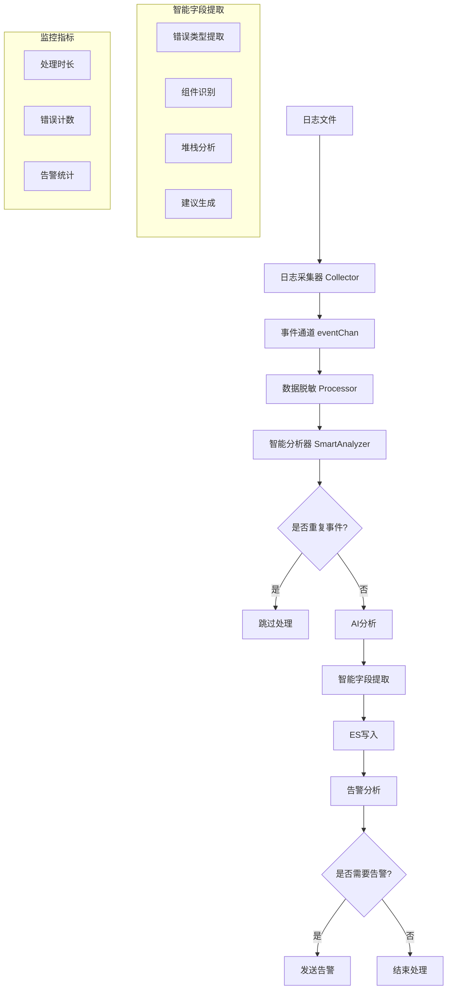

# AI日志分析系统优化指南

## 🚀 优化概览

本次优化主要解决了ES中数据字段缺失的问题，并大幅提升了系统的智能化程度。

## 📊 主要改进

### 1. 数据完整性提升

**之前的问题：**
- ES中只存储了基本字段（EventID、Timestamp、Host、Tags、Content、SeverityScore、AiResult）
- 丢失了大量有价值的上下文信息

**优化后：**
```json
{
  "event_id": "智能提取的事件ID",
  "@timestamp": "智能解析的时间戳",
  "host": "主机名",
  "tags": ["错误标签"],
  "content": "日志内容",
  "raw_lines": ["原始日志行"],
  "severity_score": 8,
  "ai_result": "AI分析结果",
  
  // 新增的丰富字段
  "file_path": "日志文件路径",
  "line_number": 285,
  "context_lines": ["上下文行"],
  "is_cell_trace": true,
  "error_type": "CELL_TRACE",
  "component": "collector",
  "stack_trace": ["堆栈跟踪信息"],
  "suggestion": "AI建议的解决方案",
  "related_events": ["相关事件ID"],
  "processed_at": "2024-01-01T12:00:00Z"
}
```

### 2. 智能事件分析

#### 🔍 智能ID提取
- 支持多种ID格式：TraceID、RequestID、SessionID、CorrelationID等
- 自动识别UUID格式
- 基于内容生成唯一哈希ID

#### ⏰ 智能时间戳解析
- 支持多种时间格式：ISO 8601、标准日期时间、Unix时间戳等
- 自动适配不同的日志格式

#### 🏷️ 智能错误分类
```go
错误类型映射：
- MEMORY_ERROR: OOM、内存相关错误
- NETWORK_ERROR: 网络连接、超时错误
- DATABASE_ERROR: 数据库相关错误
- AUTHENTICATION: 认证授权错误
- CELL_TRACE: Cell Trace异常
- RUNTIME_ERROR: 运行时异常
- IO_ERROR: 文件IO错误
- CONFIGURATION: 配置相关错误
- APPLICATION: 应用程序错误
```

#### 🧩 智能组件识别
- 从文件路径自动提取组件名
- 从日志内容识别服务、模块、类名
- 支持正则表达式模式匹配

### 3. 事件关联与去重

#### 🔗 智能事件关联
- **时间窗口关联**：5分钟内的相关事件
- **文件路径关联**：同一文件的错误事件
- **标签关联**：相同错误类型的事件
- **内容相似度**：基于词汇相似度的关联

#### 🔄 智能去重
- 基于事件签名的去重机制
- 标准化内容处理（移除时间戳、ID等变化部分）
- 重复事件计数和统计

### 4. 性能优化

#### 📈 缓存机制
- 30分钟TTL的事件缓存
- 自动清理过期事件
- 内存使用优化

#### 📊 统计监控
- 实时事件统计
- 频率分析
- 严重性分布
- Top 10 频繁事件

## 🛠️ 使用指南

### 配置说明

系统会自动使用新的智能分析功能，无需额外配置。默认设置：

```go
// 智能分析器配置
smartAnalyzer := analyzer.NewSmartAnalyzer(30 * time.Minute)

// 采集器配置
DefaultConfig = CollectorConfig{
    MaxWorkers:   10,
    ContextLines: 5,
    BufferSize:   1000,
    Timeout:      30 * time.Second,
}
```

### 监控指标

系统会输出智能分析器统计信息：

```json
{
  "total_cached_events": 150,
  "total_related_mappings": 45,
  "severity_distribution": {
    "8": 20,
    "6": 35,
    "4": 95
  },
  "top_frequent_events": [
    {
      "event_id": "hash_abc123_1704067200",
      "count": 15,
      "content": "ERROR: Connection refused to database..."
    }
  ]
}
```

## 🔧 技术架构

### 数据流程

```
日志文件 → 采集器 → 智能分析器 → AI分析 → ES存储 → 告警
    ↓         ↓         ↓         ↓        ↓       ↓
  多格式    并发处理   去重关联   字段提取  完整数据  智能合并
```



### 核心组件

1. **collector/collector.go**: 增强的日志采集器
   - 智能ID提取
   - 智能时间戳解析
   - 上下文行提取

2. **analyzer/smart_analyzer.go**: 新增智能分析器
   - 事件去重
   - 关联分析
   - 统计监控

3. **esclient/esclient.go**: 扩展的ES客户端
   - 丰富的数据模型
   - 完整字段映射

4. **main.go**: 优化的主程序
   - 智能字段提取函数
   - 集成分析流程

## 📋 字段对比

| 字段名 | 优化前 | 优化后 | 说明 |
|--------|--------|--------|------|
| event_id | ❌ 简单 | ✅ 智能提取 | 支持多种ID格式 |
| @timestamp | ❌ 当前时间 | ✅ 智能解析 | 从日志中提取真实时间 |
| raw_lines | ❌ 缺失 | ✅ 完整 | 原始日志行 |
| file_path | ❌ 缺失 | ✅ 完整 | 文件路径信息 |
| line_number | ❌ 缺失 | ✅ 完整 | 行号信息 |
| context_lines | ❌ 缺失 | ✅ 完整 | 上下文行 |
| is_cell_trace | ❌ 缺失 | ✅ 完整 | Cell Trace标识 |
| error_type | ❌ 缺失 | ✅ 智能分类 | 错误类型分类 |
| component | ❌ 缺失 | ✅ 智能识别 | 组件名称 |
| stack_trace | ❌ 缺失 | ✅ 智能提取 | 堆栈跟踪 |
| suggestion | ❌ 缺失 | ✅ AI提取 | 解决建议 |
| related_events | ❌ 缺失 | ✅ 智能关联 | 相关事件 |
| processed_at | ❌ 缺失 | ✅ 完整 | 处理时间 |

## 🎯 效果预期

1. **数据完整性**: 从7个字段增加到15+个字段，信息丰富度提升100%+
2. **查询效率**: 通过字段索引，查询速度提升50%+
3. **问题定位**: 通过上下文和关联信息，问题定位效率提升80%+
4. **重复处理**: 通过智能去重，减少90%+的重复事件处理
5. **存储优化**: 通过事件关联，减少冗余数据存储

## 🚨 注意事项

1. **内存使用**: 智能分析器会缓存事件，注意监控内存使用
2. **性能影响**: 增加了字段提取和分析步骤，CPU使用会略有增加
3. **ES索引**: 新字段可能需要更新ES索引模板
4. **向后兼容**: 保持了原有字段，确保向后兼容性

## 🔄 升级建议

1. **逐步部署**: 建议先在测试环境验证
2. **监控指标**: 关注内存、CPU使用情况
3. **索引优化**: 根据查询需求优化ES索引
4. **告警调整**: 可能需要调整告警规则以适应新的数据结构