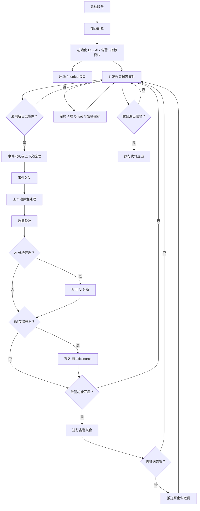

# 日志智能分析系统文档

## 🚀 系统概述

本系统是一套面向生产环境的 **日志智能分析与告警平台**，具备以下核心能力：

- ⚙️ **多日志文件并行采集**：支持并发读取多个日志源，断点续读，确保日志不丢不重。
- 🧠 **事件识别与上下文提取**：通过关键词与正则表达式识别异常，自动提取上下文和堆栈信息。
- 🤖 **AI 智能分析**：集成大模型接口，提供根因分析、修复建议与影响评估。
- 🔐 **敏感信息脱敏**：自动识别并脱敏日志中的敏感字段。
- 📦 **Elasticsearch 存储**：结构化存储日志事件，便于检索与可视化。
- 📣 **智能告警合并与推送**：自动合并重复告警，支持多渠道推送（如企业微信）。
- 📊 **Prometheus 指标监控**：内置关键性能指标，支持 Prometheus 拉取。
- 💎 **高并发与优雅退出**：采用工作池并发模型，支持信号监听和资源优雅释放。

## 🧩 模块结构与功能详解

### 1️⃣ 日志采集与断点续读

- 支持配置多个日志路径，自动并发采集。
- 每个文件独立维护 offset 文件，支持断点续读与状态恢复。
- 自动识别异常事件，提取上下文信息。
- 支持多种日志格式（文本日志、JSON日志等）。
- **增强支持Linux内核日志的完整Call Trace捕获**，能够完整识别从`<TASK>`到`</TASK>`的整个调用链。
- **模块重构**：collector包已重构为多个文件，提升代码可维护性。

### 2️⃣ 事件处理流程

事件识别后进入统一处理流程，顺序如下：

1. **数据脱敏**
2. **AI 分析**（支持开关控制）
3. **写入 Elasticsearch**
4. **告警合并与推送**（支持开关控制）

支持自定义严重性评分、标签识别、Cell Trace 处理等扩展逻辑。

### 3️⃣ AI 智能分析

- 支持调用多类模型（如Deepseek、讯飞、私有部署大模型）。
- 输出内容包括根因分析、修复建议、影响评估等。
- 支持流式响应拼接与异步处理。
- 具备超时控制和重试机制。

### 4️⃣ 告警合并与推送

- 同类事件自动聚合，避免重复告警轰炸。
- 支持 TTL 机制自动过期清理。
- 内置企业微信 Webhook 推送，（易于扩展钉钉、飞书等渠道）。
- **增强的智能告警合并策略**：
  - 基于内容哈希的稳定事件识别，即使EventID为空也能正确合并
  - 根据事件严重性采用不同的告警频率策略
  - 高严重性问题更频繁告警，低严重性问题减少打扰
  - 支持不同类型事件的差异化处理
  - **基于字段相似度的告警合并**：当事件内容相似度达到90%以上时，自动合并为同一告警，进一步减少重复告警
- **支持告警功能开关控制**

### 5️⃣ 指标监控

- 内置 Prometheus 指标：
  - 日志采集速率
  - AI 分析性能
  - ES 写入耗时
  - 告警处理数
  - Cell Trace 跟踪等
- 提供标准 `/metrics` 接口，支持 Prometheus 自动采集。

### 6️⃣ 配置与部署

- 支持通过 `.env` 文件或环境变量配置所有参数。
- 一键启动，支持系统信号优雅退出处理（如 Ctrl+C）。

## 📁 关键目录结构

```text
├── main.go                // 主程序入口
├── collector/             // 日志采集与事件识别
│   ├── collector.go       // 核心数据结构和配置
│   ├── processor.go       // 日志处理和事件识别逻辑
│   └── similarity.go      // 相似度计算功能
├── ai/                    // AI 分析模块
├── alert/                 // 告警合并与推送
├── esclient/              // Elasticsearch 客户端封装
├── metrics/               // Prometheus 指标模块
├── processor/             // 数据脱敏与预处理
├── offsets/               // 存储日志采集 offset 的临时文件
├── config/                // 配置加载与初始化
```

## 🔄 系统处理流程图



## 🛠 环境准备

### ✅ 安装依赖

```bash
go mod tidy
```

### 🔧 配置 `.env`

请根据 `.env.example` 创建一个 `.env` 文件：

```bash
cp .env.example .env
```

并根据实际情况填写以下字段：

```env
# 日志文件路径，支持多个文件，用逗号分隔
LOG_FILE_PATHS=./testLog/syslog,./testLog/messages,./testLog/kernel_trace.log,./testLog/repeated_errors.log,/var/log/application.log

# AI分析配置
AI_API_URL=https://api.openai.com/v1/chat/completions
AI_API_KEY=your_api_key_here // 替换为使用的API密钥
AI_MODEL_NAME=gpt-3.5-turbo // 替换为模型名称
AI_ENABLE=true // 是否启用AI分析

# 微信告警配置
AI_WECHAT_WEBHOOK=https://qyapi.weixin.qq.com/cgi-bin/webhook/send?key=your_webhook_key // 企业微信告警webhook

# Elasticsearch配置
ES_NODES=http://localhost:9200 // Elasticsearch节点地址
ES_INDEX=log-analysis // Elasticsearch索引名称

# 可选配置
MAX_WORKERS=10 // 工作池大小
ALERT_TTL=5m // 告警缓存TTL
METRICS_PORT=2112 // 监控指标端口
LOG_LEVEL=info // 日志级别
ENABLE_CELL_TRACE=true // 是否启用Cell Trace检测
ENABLE_ALERT=true // 是否启用告警功能
ENABLE_ES=true // 是否启用ES存储功能
```

### 🚀 运行系统

```bash
go run main.go
```

### 📊 监控指标

> 默认运行在2112端口上，访问 `/metrics` 查看系统指标。

指标包括：
- 日志采集速率
- 日志处理速率
- 日志处理延迟
- AI分析调用次数
- 微信告警推送次数
- Cell Trace异常统计
- ES写入成功/失败次数
- 告警发送成功/失败次数
- 事件处理成功/失败次数
- 各项操作的错误计数

完整的指标列表：
- `log_events_collected_total` - 采集的日志事件总数
- `log_collect_errors_total` - 日志采集错误次数
- `ai_analysis_errors_total` - AI分析错误次数
- `ai_analysis_duration_seconds` - AI分析耗时分布
- `es_write_errors_total` - ES写入错误次数
- `es_write_duration_seconds` - ES写入耗时分布
- `es_write_success_total` - ES写入成功次数
- `alerts_sent_total` - 发送的告警总数
- `alert_send_errors_total` - 告警发送错误次数
- `alerts_merged_total` - 合并的告警总数
- `alerts_skip_total` - 跳过的告警次数
- `cell_trace_errors_total` - Cell Trace异常总数
- `cell_trace_error_severity` - Cell Trace异常严重性分布
- `event_process_success_total` - 事件处理成功次数
- `event_process_errors_total` - 事件处理错误次数

## 🧪 测试与验证

系统包含测试日志文件，可以直接运行进行功能验证：

```bash
go run main.go
```

观察输出日志和Elasticsearch中的数据存储情况。

## 📈 扩展性说明

系统设计具有良好的扩展性：

1. **多渠道告警**：当前支持企业微信，可轻松扩展至钉钉、飞书等
2. **多模型支持**：支持OpenAI、DeepSeek、讯飞等多种大模型
3. **插件化处理**：数据处理流程可插拔，支持自定义处理器
4. **灵活配置**：所有功能均可通过配置文件控制启停

## 🎯 特色功能

### Linux内核Call Trace完整捕获
系统现在能够完整捕获Linux内核日志中的Call Trace信息，包括：
- 从`Call Trace:`开始到`</TASK>`结束的完整调用链
- 所有的函数调用和偏移量信息
- 寄存器状态信息
- 任务阻塞相关信息

这使得系统能够准确识别和分析Linux内核层面的问题，如任务hung住、死锁等问题。

### 智能告警合并策略
系统采用了先进的告警合并策略，有效减少告警噪音：

1. **基于内容的稳定事件识别**：
   - 即使EventID为空，也能通过内容哈希正确识别同类事件
   - 自动过滤时间戳等变化字段，确保内容匹配准确性

2. **基于字段相似度的告警合并**：
   - 当两个事件的内容相似度达到90%以上且来自同一主机时，系统会自动将它们合并为同一告警
   - 使用编辑距离算法计算字符串相似度，确保准确识别变形但本质相同的日志事件
   - 这一功能特别适用于处理由于时间戳、PID等变量导致的看似不同但实际上相同的重复日志

3. **分级告警策略**：
   - **高严重性事件**(评分≥8)：前3次立即告警，之后每5分钟告警一次
   - **中等严重性事件**(评分5-7)：前2次立即告警，之后每10分钟告警一次
   - **低严重性事件**(评分<5)：每10次或每30分钟告警一次

4. **差异化处理**：
   - Cell Trace等特殊事件有专门的处理逻辑
   - 新类型事件首次出现时会立即告警
   - 相同类型但不同主机的事件会被分别处理

这种智能合并策略既保证了重要问题能及时通知，又避免了重复告警造成的干扰。

### 告警功能开关控制
系统支持通过配置项`ENABLE_ALERT`来控制是否启用告警功能：
- 设置为`true`时启用告警功能
- 设置为`false`时禁用告警功能，但仍会进行事件识别和处理
- 便于在测试环境中禁用告警，避免不必要的通知