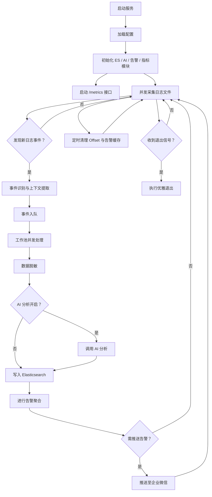

# 日志智能分析系统文档

[](https://github.com/aiicie/logai)
[](LICENSE)
[](https://github.com/aiicie/logai/actions)
[](https://goreportcard.com/report/github.com/aiicie/logai)
[](https://github.com/aiicie/logai/stargazers)
[](https://github.com/aiicie/logai/network)
[](https://github.com/aiicie/logai/issues)
[](https://github.com/aiicie/logai/pulls)
[](https://github.com/aiicie/logai/graphs/contributors)
[](https://codecov.io/gh/aiicie/logai)


## 🚀 系统概述

本系统是一套面向生产环境的 **日志智能分析与告警平台**，具备以下核心能力：

- ⚙️ **多日志文件并行采集**：支持并发读取多个日志源，断点续读，确保日志不丢不重。
- 🧠 **事件识别与上下文提取**：通过关键词与正则表达式识别异常，自动提取上下文和堆栈信息。
- 🤖 **AI 智能分析**：集成大模型接口，提供根因分析、修复建议与影响评估。
- 🔐 **敏感信息脱敏**：自动识别并脱敏日志中的敏感字段。
- 📦 **Elasticsearch 存储**：结构化存储日志事件，便于检索与可视化。
- 📣 **智能告警合并与推送**：自动合并重复告警，支持多渠道推送（如企业微信）。
- 📊 **Prometheus 指标监控**：内置关键性能指标，支持 Prometheus 拉取。
- 💎 **高并发与优雅退出**：采用工作池并发模型，支持信号监听和资源优雅释放。

------

## 🧩 模块结构与功能详解

### 1️⃣ 日志采集与断点续读

- 支持配置多个日志路径，自动并发采集。
- 每个文件独立维护 offset 文件，支持断点续读与状态恢复。
- 自动识别异常事件，提取上下文信息。

### 2️⃣ 事件处理流程

事件识别后进入统一处理流程，顺序如下：

1. **数据脱敏**
2. **AI 分析**（支持开关控制）
3. **写入 Elasticsearch**
4. **告警合并与推送**

支持自定义严重性评分、标签识别、Cell Trace 处理等扩展逻辑。

### 3️⃣ AI 智能分析

- 支持调用多类模型（如Deepseek、讯飞、私有部署大模型）。
- 输出内容包括根因分析、修复建议、影响评估等。
- 支持流式响应拼接与异步处理。

### 4️⃣ 告警合并与推送

- 同类事件自动聚合，避免重复告警轰炸。
- 支持 TTL 机制自动过期清理。
- 内置企业微信 Webhook 推送，（易于扩展钉钉、飞书等渠道）。

### 5️⃣ 指标监控

- 内置 Prometheus 指标：
  - 日志采集速率
  - AI 分析性能
  - ES 写入耗时
  - 告警处理数
  - Cell Trace 跟踪等
- 提供标准 `/metrics` 接口，支持 Prometheus 自动采集。

### 6️⃣ 配置与部署

- 支持通过 `.env` 文件或环境变量配置所有参数。
- 一键启动，支持系统信号优雅退出处理（如 Ctrl+C）。

------

## 📁 关键目录结构

```text
├── main.go                // 主程序入口
├── collector/             // 日志采集与事件识别
├── ai/                    // AI 分析模块
├── alert/                 // 告警合并与推送
├── esclient/              // Elasticsearch 客户端封装
├── analyzer/              // 事件分析与上下文提取
├── metrics/               // Prometheus 指标模块
├── processor/             // 数据脱敏与预处理
├── offsets/               // 存储日志采集 offset 的临时文件
├── config/                // 配置加载与初始化
```

------

## 🔄 系统处理流程图



## 🛠 环境准备

### ✅ 安装依赖

```bash
go mod tidy
```

### 🔧 配置 `.env`

请根据 `.env.example` 创建一个 `.env` 文件：

```bash
cp .env.example .env
```

并根据实际情况填写以下字段：

```env
# 日志文件路径，支持多个文件，用逗号分隔
LOG_FILE_PATHS=./testLog/syslog,./testLog/messages,/var/log/application.log

# AI分析配置
AI_API_URL=https://api.openai.com/v1/chat/completions
AI_API_KEY=your_api_key_here // 替换为使用的API密钥
AI_MODEL_NAME=gpt-3.5-turbo // 替换为模型名称
AI_ENABLE=true // 是否启用AI分析

# 微信告警配置
AI_WECHAT_WEBHOOK=https://qyapi.weixin.qq.com/cgi-bin/webhook/send?key=your_webhook_key // 企业微信告警webhook

# Elasticsearch配置
ES_NODES=http://localhost:9200 // Elasticsearch节点地址
ES_INDEX=log-analysis // Elasticsearch索引名称
```

### � 运行系统

```bash
go run main.go
```

### 📊 监控指标

> 默认运行在2112端口上，访问 `/metrics` 查看系统指标。

指标包括：
- 日志采集速率
- 日志处理速率
- 日志处理延迟
- AI分析调用次数
- 微信告警推送次数
